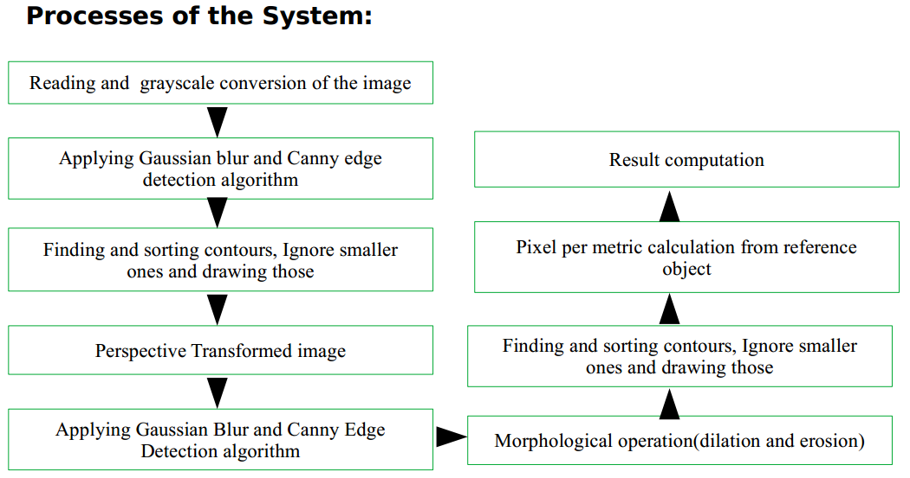
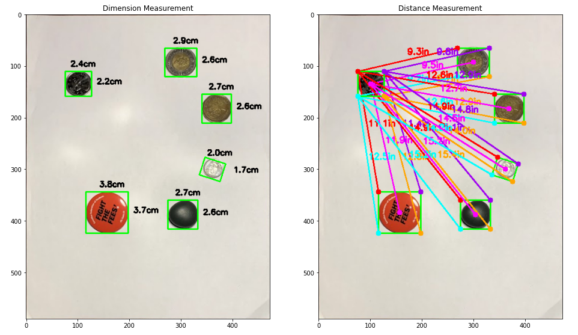
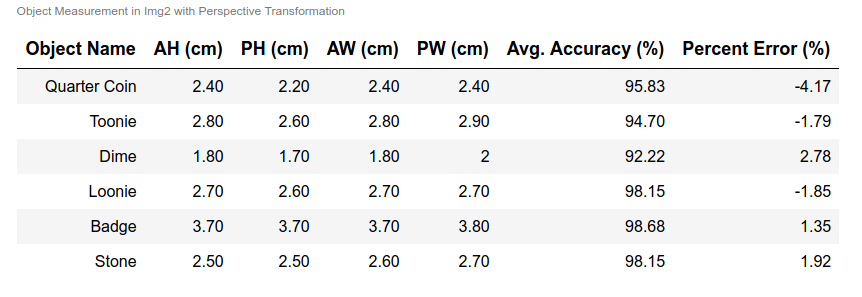
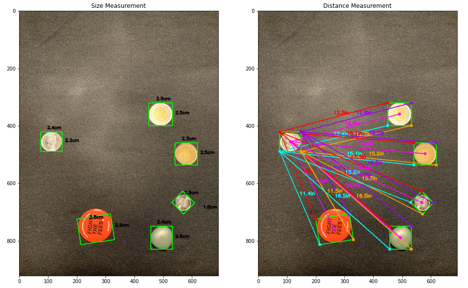
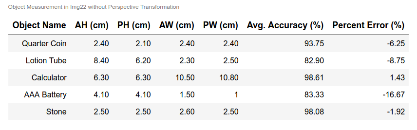

# An Approach of dimensioning and measuring distance from a reference object to other objects in an image with perspective transformation.
The project also compares performance of proposed system with a system without perspective transformation.

> #### Abstract— 
Object detection, dimensioning of the objects, and distance measurement plays a vital role in medical application, vehicle control, robotic movement control and many more. Undesirable measurement in objects' size and distance between them may occur as near things appear more prominent compared to those who are far away in a photograph. This study proposes a better method of measuring the objects' dimensions and distance between them based on perspective transformation followed by Gaussian filtering, canny edge detection technique and morphological operator with higher accuracy utilizing OpenCV libraries. With the goal of accurate measurement, this report compares the accuracy in dimensioning with and without perspective transformation on the images captures by smartphone.
> #### Index Terms— 
Object detection, Perspective Transformation, Gaussian Filter, Canny Edge Detection, Morphological Operator, OpenCV.
> #### Processes of the System—

> #### Steps of the System—
> **A. Image Pre-processing and Perspective Transformation:**
  - Reading and input image, resizing it for quicker process, doing grayscale conversion , next steps are to apply 5X5 Gaussian filter to remove high-frequency noise and call.
  - Canny edge detection algorithm with threshold 75 and 200 to smooth edge detection process.
  - Finding, sorting contours then considering the significant contours only, Drawing those with OpenCV function
  - Then again applying a 15x15 Gaussian filter to blur the image to pass through Canny edge detector with 50 and 70 threshold. Then applying morphological operator (dilation + erosion) with iteration 1 to close any gaps in the edge map.
> **B. Object Segmentation:**
  - After getting external contours from the edge map with cv2.RETR_EXTERNAL, next steps are to sort those contours from left to right and detect the reference object.
> **C. Reference Object:**
  - This reference object will help to count number of pixels captured by each object in an image.
  - This pixel number provides the approximate number of pixels per every unit measurement of its width, which is known as pixel per metric. We can express pixels per metric as follows: 
    -   pixel per metric = width of the object in pixel / actual width of the object.
> **D. Computation of Results:**
  - Then scanning through the previously found contour list, next steps are to cancel out insignificant contours compute and order rotated bounding box with cv2.boxPoint function from top-left to bottom-left (clockwise).
  - Then an object's height and width are calculated from the division of Euclidean distance between the set of midpoints of the object and pixels per metric parameter.
  - Lastly, our model computes the distance for the bounding box coordinates and the centroid coordinates by dividing the Euclidean distance between the ordered bounding box points of the reference object and the targeted object by pixels per metric.

> #### Required Packages and Installation— 
- pip install opencv-python
- pip install matplotlib
- pip install numpy
- pip install imutils
- pip install scipy
- pip install skimage

> #### Sample Output—

License
----

MIT

## Credit

